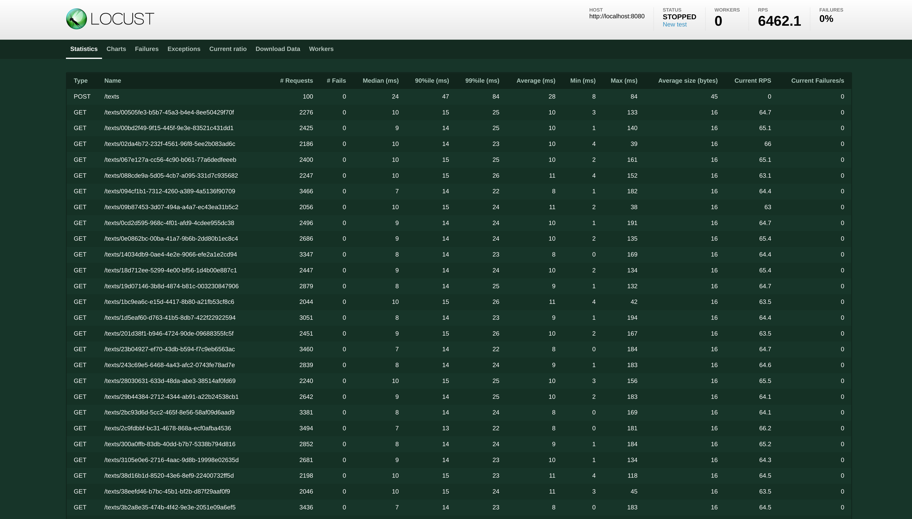
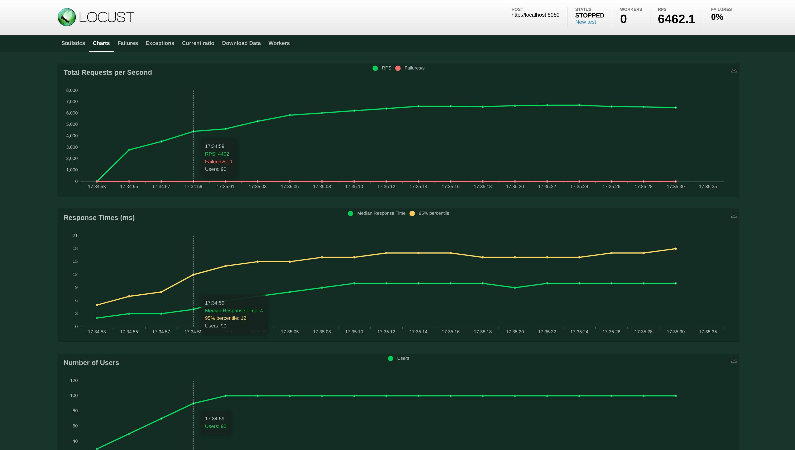

# Locust Performance Testing

We use [Locust][locust-web] to perform our performance testing.

[locust-web]: https://locust.io/

## Starting

```sh
pipenv install
pipenv run locust --users 40 --spawn-rate 10 -t 2m
```

All parameters are optional when running in the browser, as they can be configured in the GUI from
locust itself.

> Add a `--headless` flag to run it directly in the command line.

### Distributed Load

We might need to distribute the load to make sense of applications that have decent performance.
This can be done by starting several locust instances that are connected:

```sh
pipenv run locust --users 40 --spawn-rate 10 -t 2m --master
pipenv run locust --worker
pipenv run locust --worker
pipenv run locust --worker
pipenv run locust --worker
```

You can expose your port 8089 on your firewall to make Locust available on your local network.

## Sample Views




